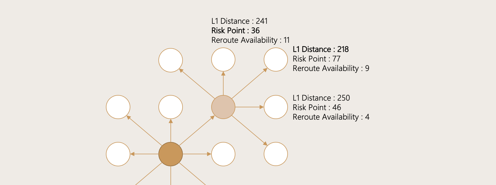

안녕하세요. 테스트를 위해 임시로 개설된 깃허브 블로그입니다. 방문해주셔서 감사합니다. 해당 페이지의 링크는 실제로 동작하지 않습니다. 
[마크다운 언어 가이드 링크](https://gist.github.com/ihoneymon/652be052a0727ad59601)

# 페이지 소개

이 페이지는 연구를 진행하면서 각종 자료를 정리하기위해 만들어졌습니다. 실제로 이 페이지를 얼마나 작성할 수 있을지에 대해서는 잘 모르겠습니다. 상세한 연구 주제 및 페이지에 대한 소개는 작업물이 쌓이게 되면 천천히 작성을 늘리도록 하겠습니다. 보잘것 없는 블로그에 방문해주셔서 감사합니다. 

블로그 방문 중 문의사항이 있으시면 meno9428@gmail.com 으로 메일 부탁드립니다. 

## 길찾기 알고리즘
2D 혹은 3D Path Planning 을 위한 알고리즘 및 그 논문들에 대해 다룹니다. 일부는 Implementation 단계까지 갈 수도 있고, 아이디어에 대한 소개로 끝마쳐질수도 있습니다. 
[길찾기 알고리즘](./docs/CONTRIBUTING.html).

## 이산사건 시뮬레이션
준비중 입니다.
